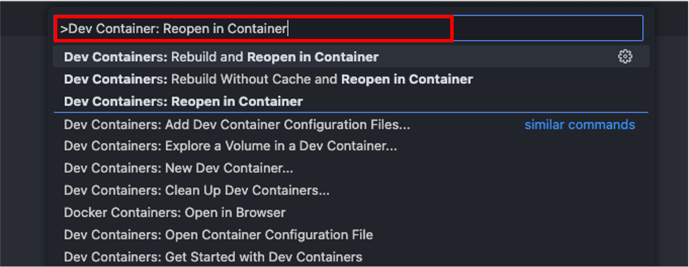
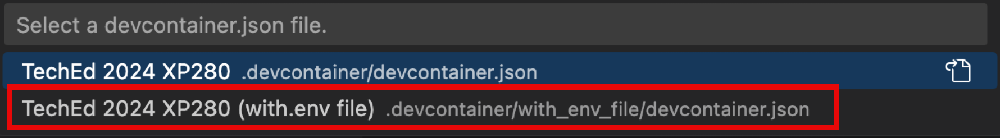
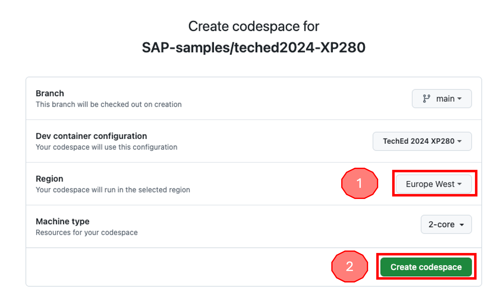
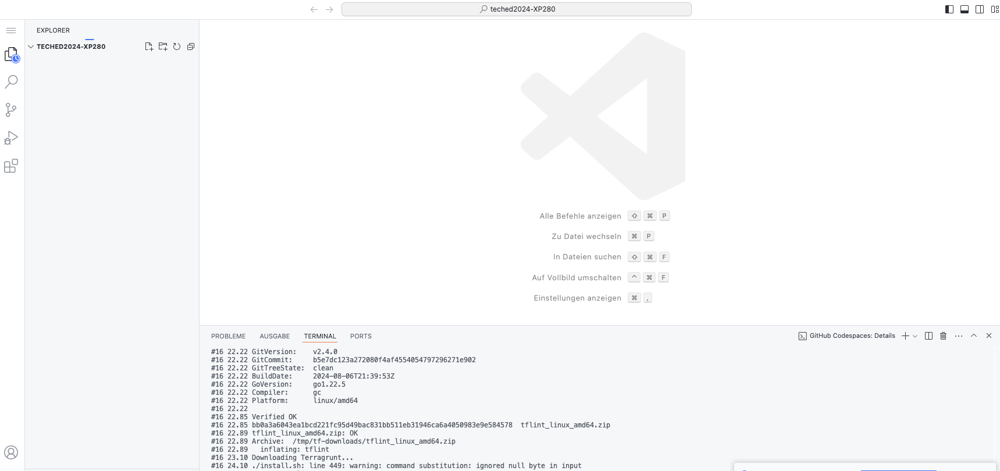
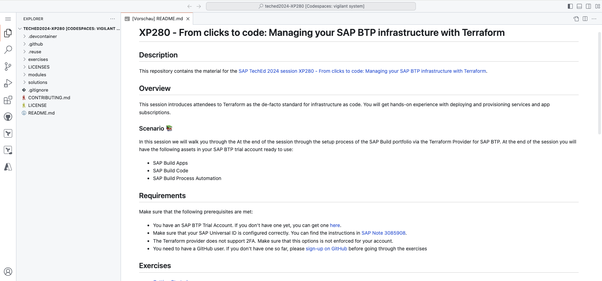

# Getting Started

To execute the exercises, you have the following options concerning the required tools installed:

- *Recommended*: [Use the provided dev container](#dev-container-recommended)
- [Use of GitHub Codespaces](#github-codespaces)
- [Local installation](#local-installation)

You find details about the installation of the tools in the following sections

In general, you must clone this GitHub repository. You must have the Git client installed on your machine. You can find the installation instructions [here](https://git-scm.com/downloads).

You can then clone the repository via the following command:

```bash
git clone https://github.com/SAP-samples/teched2024-XP280.git
```

you find the exercises in the folder `exercises`.

## Local Installation

You can install the required tools locally on your machine. The following tools are required:

- [Terraform CLI](https://developer.hashicorp.com/terraform/install?product_intent=terraform)
- An editor of your choice. We recommend [Visual Studio Code](https://code.visualstudio.com/Download) with the [Terraform extension](https://marketplace.visualstudio.com/items?itemName=HashiCorp.terraform).

## Dev Container (recommended)

As an alternative to the local installation, you can use the provided dev container that contains all required tools. This requires that you have [Docker](https://www.docker.com/products/docker-desktop) installed on your machine. In addition you need the dev container extension for Visual Studio Code. You can find detailed instructions about the setup [here](https://code.visualstudio.com/docs/devcontainers/containers#_getting-started).

To start a dev container Docker must be running on your machine.

To use the dev container you must open the folder that contains the cloned repository in Visual Studio Code. You will be asked if you want to reopen the folder in the dev container. Confirm this.

If this is not the case execute the following steps:

1. Add a `devcontainer.env` file into the `.devcontainer` directory and add the following two envionment variables into the file:

   ```bash
   BTP_USERNAME='your SAP BTP username'
   BTP_PASSWORD='your SAP BTP password'
   ```

   and save the changes.
   
1. Open the command palette in Visual Studio Code:

    - Windows / Linux: `Ctrl + Shift + P`
    - Mac: `Cmd + Shift + P`

1. Enter `Dev Containers: Reopen in Container` and confirm with `Enter`.

    

1. You will then be asked to select a dev container. Select the `TechEd 2024 XP280` container:

    

The dev container will automatically start and you are ready to go.

## GitHub Codespaces

To use [Codespaces](https://docs.github.com/codespaces/overview) you must have a GitHub account. If you don't have one so far, please [sign-up on GitHub](https://github.com/signup) before going through the exercises.

You can then access the Codespace following these steps:

1. Open the [GitHub repository of the TechEd 2024 session 280](https://github.com/SAP-samples/teched2024-XP280).

    

1. Click on this button and create the code space:

   [](https://github.com/codespaces/new?hide_repo_select=true&ref=main&repo=841902616&skip_quickstart=true&machine=basicLinux32gb&geo=EuropeWest&devcontainer_path=.devcontainer%2Fdevcontainer.json)


1. A congiguration overview will be opened in the browser. You can adjust the region to a location near you (1) and confirm the creation of the Codespace (2):

    

    This will take a few minutes. Be patient 🙂

1. While the Codespace is created for you, you will see this screen

    

1. Once all is done, you are in your Codespace.

    

> [!IMPORTANT]
> GitHub codespaces are free for a certain amount of time per month. For the hands-on session the free time is more than enough. **Don't forget to delete your codespace again after the hands-on session!**

## Exporting environment variables

The last step in the setup is the export of the environment variables that are required to authenticate against the Terraform provider for SAP BTP. Export the following environment variables:

- Windows:

    ```pwsh
    $env:BTP_USERNAME=<your SAP BTP username>
    $env:BTP_PASSWORD='<your SAP BTP password>'
    ```

- Linux/MacOS/GitHub Codespaces:

    ```bash
    export BTP_USERNAME=<your SAP BTP username>
    export BTP_PASSWORD='<your SAP BTP password>'
    ```

Validate that the values are set via:

- Windows: `$env:BTP_USERNAME` and `$env:BTP_PASSWORD`
- Linux/MacOS/GitHub Codespaces: `echo $BTP_USERNAME` and `echo $BTP_PASSWORD`

## Cleanup SAP BTP Account

We are going to provision several resources like entitlements and subscriptions through the course of this hands-on. As we are working in a trial account there might be limitations e.g., concering the available quotas.

If you created a new trial account, you could delete the existing subaccount from the global account, so that you start from an empty global account

If you have already been working with your SAP BTP trial account, make sure that the enttilements for the following services/application and plan combinations are available:

| Service/Application | Plan |
|---                  |---
| build-code          | free
| sapappstudiotrial   | trial
| process-automation  | free

> [!WARNING]
> If you have the plans already in use in a different subaccount the execution of Terraform will fail due to missing available entitlements

## Summary

You've now prepared your development environment and have all information to finally start using Terraform provider for SAP BTP.

Continue to - [Exercise 1 - Setup Basics of Terraform Configuration](../ex1/README.md).
