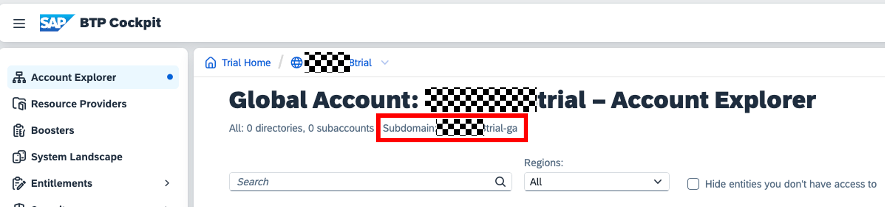

# Exercise 1 - Setup Basics of Terraform Configuration

In this exercise, we will implement the basic Terraform configuration.

> [!NOTE]
> You find the solution for this exercise in the [solutions/ex1](../../solutions/ex1/) folder.

## Exercise 1.1 - Create the necessary files

After completing these steps, you will have created the file layout needed for the Terraform configuration.

1. Go to the root directory of this project and create a new directory called `terraform_build`
1. Navigate into the directory `terraform_build`.
1. Create the following files inside of the directory:
    - `main.tf` - this file will contain the main Terraform configuration
    - `provider.tf` - this file will contain the provider configuration
    - `variables.tf` - this file will contain the variable definitions making your terraform setup more flexible
    - `outputs.tf` - this file will contain the output definitions, so that you get the information you need after the terraform setup is done
    - `terraform.tfvars` - this file will contain the actual values for the variables defined in `variables.tf` as key-value pairs

## Exercise 1.2 - Create the provider configuration

After completing these steps, you will have created the provider configuration.

The basic configuration of the Terraform provider for SAP BTP is available in the official documentation located in the [Terraform registry](https://registry.terraform.io/providers/SAP/btp/latest/docs). Looking at the documentation we see that we need to tell Terraform which provider to use and how to authenticate against the SAP BTP. Let's do that

1. Open the file `provider.tf`.
1. Add the following code to the file and save the changes:

      ```terraform
      terraform {
        required_providers {
          btp = {
            source  = "SAP/btp"
            version = "~> 1.11.0"
          }
        }
      }

      # Please checkout documentation on how best to authenticate against SAP BTP
      # via the Terraform provider for SAP BTP
      provider "btp" {
        globalaccount  = var.globalaccount
      }
      ```

      In accordance to the documentation we instruct Terraform to use the provider in version 1.11.0 . We also added the authentication information as a [variable](https://developer.hashicorp.com/terraform/language/values/variables) to increase flexibility. To make the story complete we need to define the variable.

1. Open the file `variables.tf`.
1. Add the following code to the file and save the changes:

    ```terraform
    variable "globalaccount" {
      type    = string
    }
    ```

1. As we do not want to hard code or default the value for the global account, we need to provide the value in the `terraform.tfvars` file. Open the file `terraform.tfvars` and add the following code:

    ```terraform
    globalaccount = "<your-global-account-subdomain>"
    ```

    Enter the subdomain value of *your* global account which has the format `xxxxxxxxtrial-ga` and save your changes.

    You find the value in the SAP BTP Cockpit in the account explorer:

     

## Summary

You've now finished the basic setup namely the provider configuration to start with the Terraform configuration for our desired setup.

Continue to - [Exercise 2 - Create a Subaccount](../ex2/README.md)
