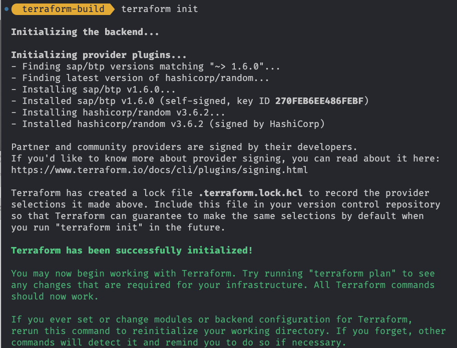
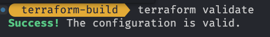
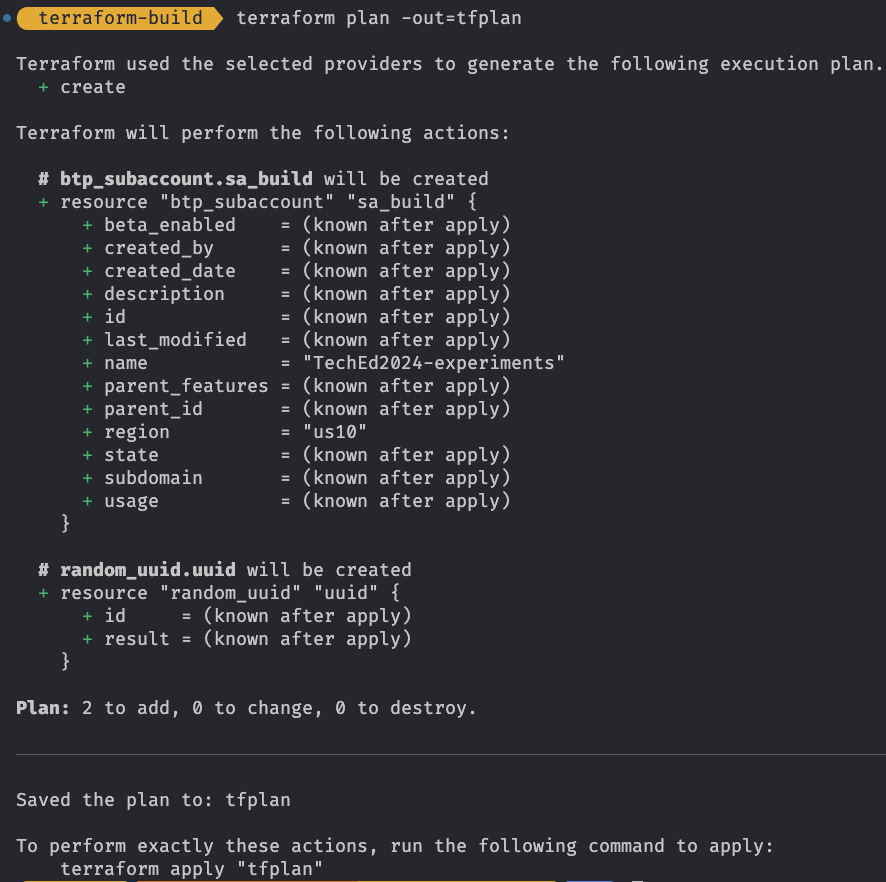
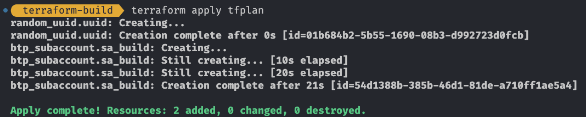
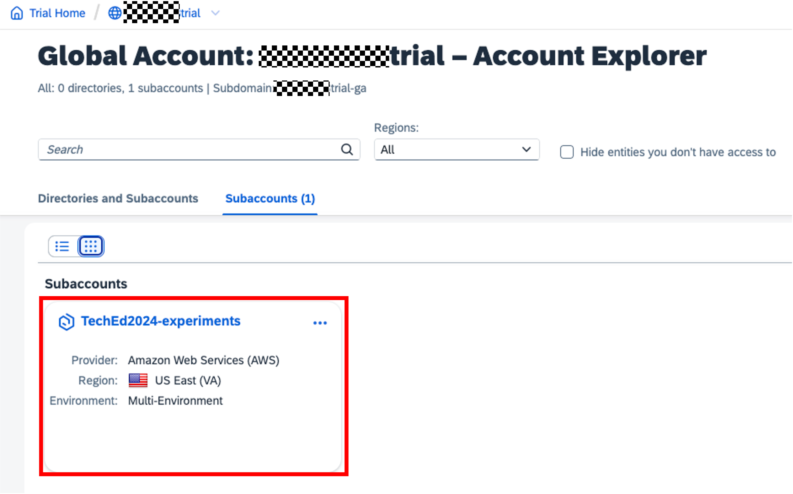

# Exercise 2 - Create a Subaccount

In this exercise, we will use Terraform to create a subaccount in your global account.

> [!NOTE]
> You find the solution for this exercise in the [solutions/ex2](../../solutions/ex2/) folder.

## Exercise 2.1 - Create the Terraform configuration

After completing these steps, you will have defined the configuration for the subaccount creation using Terraform.

To setup a subaccount we must identify the appropriate Terraform resource. The official documentation will help us with this.

As we want to create a subaccount the resource we are looking for is [`btp_subaccount`](https://registry.terraform.io/providers/SAP/btp/latest/docs/resources/subaccount). In the documentation we find all the required and optional parameters we can use to configure the subaccount. We want to use the following parameters for our subaccount:

- `name` - the name of the subaccount. As we do not want to hard code the name, we will be using a variable for this.
- `subdomain` - The value for the subdomain. To keep this unique we want to define this as a combination of a user-provided prefix plus a random UUID. No matter what the user provides as prefix, we will always transform the value to lowercase and replace all `_` with `-`.
- `region` - the region where the subaccount should be created. We want to be flexible, so we will use a variable for this. To make it easy for the user we ensure that no matter how the variable is provided, we always transform the value to lowercase.

Let's do that.

1. First we define the variables that we later use in the configuration. Open the file `variables.tf` and add the following code to define the three variables for *subaccount domain prefix*, *subaccount name* and *region*:

      ```terraform
      variable "subaccount_domain_prefix" {
        type        = string
        description = "The prefix used for the subaccount domain"
        default     = "TechEd2024-TF"
      }

      variable "subaccount_name" {
        type        = string
        description = "The subaccount name."
        default     = "TechEd2024-experiments"
      }

      variable "region" {
        type        = string
        description = "The region where the subaccount shall be created in."
        default     = "us10"
      }
      ```

      It is best practice to provide a meaningful description for the variables. As you can see we also provided *default values* for the variables. Feel free to change them to your liking. Save your changes once you are finished.

      As we have defined the necessary input, we can now start with the actual configuration.

1. As we need to construct the value of the subaccount domain we must use a few features of Terraform to achieve this, namely:

    - A [local variable](https://developer.hashicorp.com/terraform/language/values/locals) to construct the value based on the input.
    - The [`random_uuid` resource](https://registry.terraform.io/providers/hashicorp/random/latest/docs/resources/uuid) to make the value unique.
    - Two Terraform built-in functions to [replace](https://developer.hashicorp.com/terraform/language/functions/replace) the `_` with `-` and to make the value all [lower](https://developer.hashicorp.com/terraform/language/functions/lower) case.

    Let us bring this together. Open the `main.tf` file and add the following code to fetch a random UUID and construct the subaccount domain:

    ```terraform
    resource "random_uuid" "uuid" {}

    locals {
      subaccount_domain = lower(replace("${var.subaccount_domain_prefix}-${random_uuid.uuid.result}", "_", "-"))
    }
    ```

1. With this we can continue to define the actual subaccount resource. Add the following code to the `main.tf` file:

    ```terraform
    resource "btp_subaccount" "sa_build" {
      name      = var.subaccount_name
      subdomain = local.subaccount_domain
      region    = lower(var.region)
    }
    ```

    We are using the variables we defined before and the local variable to fill the required parameters of the resource. We are also using the `lower` function inline to ensure that the region is always in lowercase.

    Save your changes.

## Exercise 2.2 - Execute Terraform

After completing these steps, you will have executed the Terraform configuration and successfully created a subaccount in your global account. To execute Terraform open a new Terminal window to enter the Terraform commands:

1. In the terminal change to the `terraform_build` directory that you already created.

    ```bash
    cd terraform_build
    ```


1. First we want to make sure that everything is properly formated. The Terraform CLI supports us with this.

    ```bash
    terraform fmt
    ```

   This command executes the formatting of your configuration so that it is compliant with the Terraform best practices.

1. As we are using Terraform for the first time, we must initialize the setup. We do so via the command:

    ```bash
    terraform init
    ```
    Your should see the output similar to the following in the terminal:

    

    This will initialize the setup and download the required provider. You can also check your file system to see that a `.terraform` directory and a file called `.terraform.lock.hcl` have been created.

    

1. Now we want to make a static check of our configuration to make sure that the configuration at design time is syntactically correct. We do so via the the following command:

    ```bash
    terraform validate
    ```

    

    That looks good. So time to take the real actions.

1. Next we execute the so called *planning* to see what Terraform wants to change:

    ```bash
    terraform plan -out=tfplan
    ```

    This reuslts in the following output:

    

    As expected it shows that the subaccount will be created. We saved the plan via the `-out` parameter to a file for using it in the apply. As the result matches our expectations we apply the configuration:

    ```bash
    terraform apply tfplan
    ```

    This results in the following output:

    

    As a result you see in the output that Terraform successfully created the subaccount. You can also check the SAP BTP cockpit to see the newly created subaccount:

    

## Summary

You've now made the first step in defining your SAP BTP Infrastructure as Code namely a subaccount. Let's add some more resources to the setup now!

Continue to - [Exercise 3 - Setup of SAP Build Code](../ex3/README.md)
