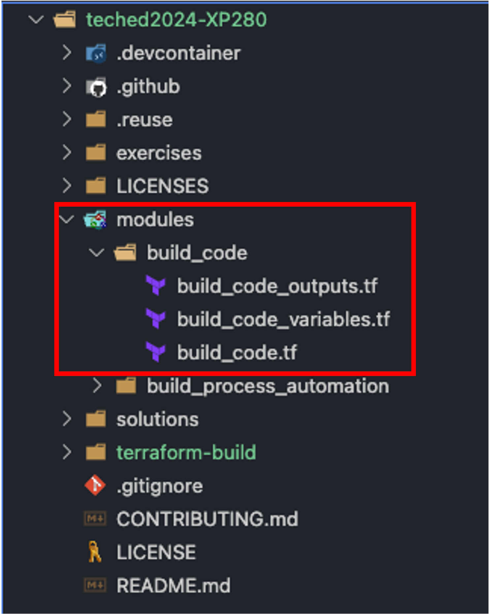
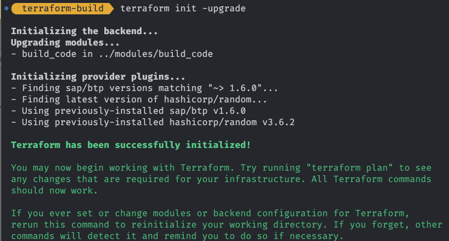
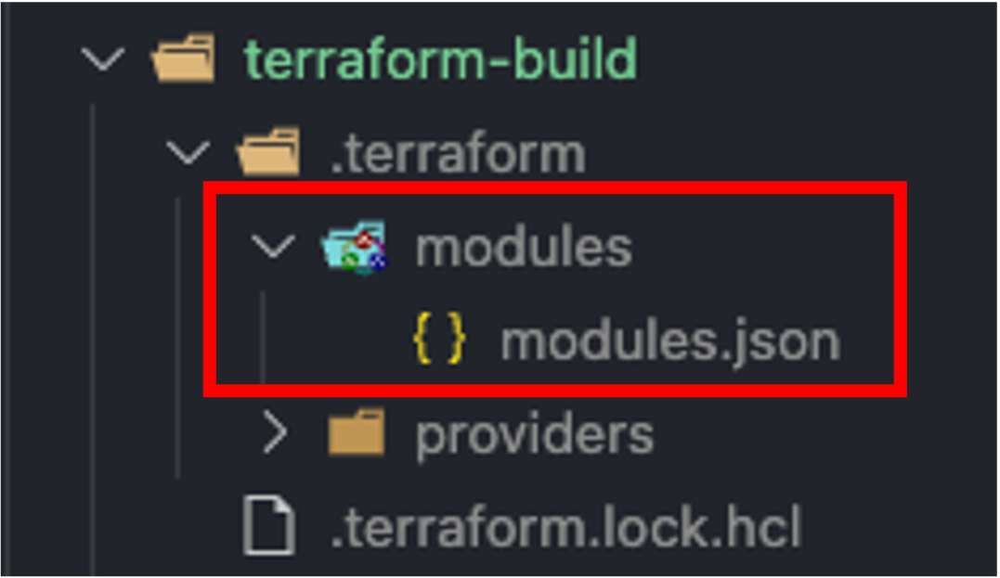
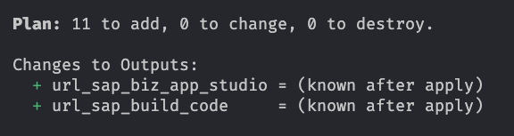
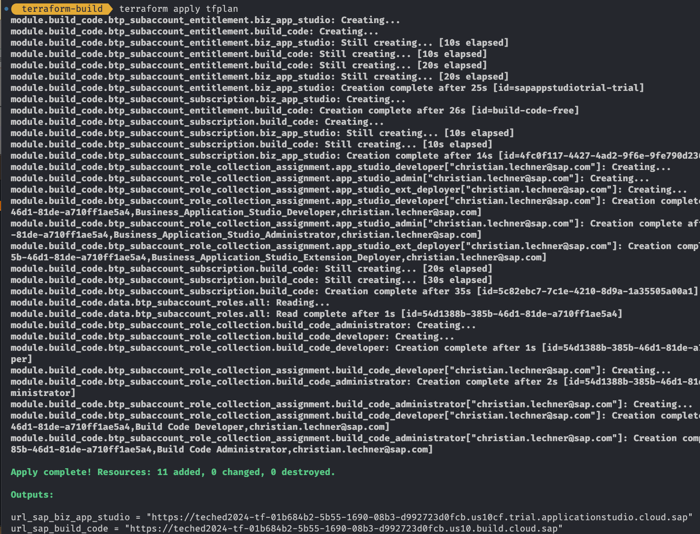
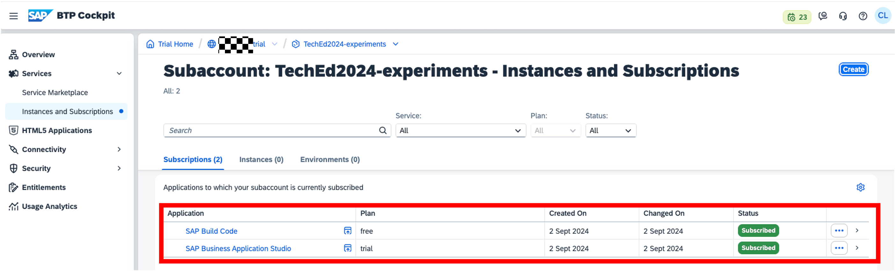
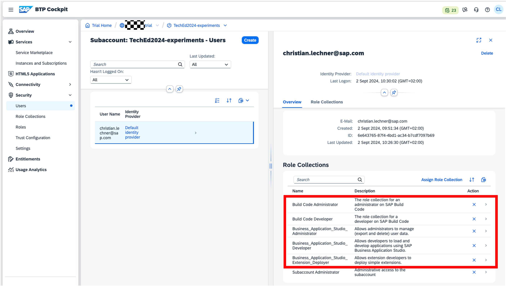

# Exercise 3 - Setup of SAP Build Code

In this exercise, we will enhance the existing configuration to setup SAP Build Code leveraging a Terraform module.

> **Note** - You find the solution for this exercise in the [solutions/ex3](../../solutions/ex3/) folder.

## Exercise 3.1 - Become familiar with the SAP Build Code module

After completing these steps you will know how the module for SAP Build Code is structured.

The setup of SAP Build Code consists of several components:

- Assignment of the entitlement for SAP Build Code and Business Application Studio (BAS) to the subaccount.
- Subscription to the SAP Build Code as well as to the BAS application.
- Assignment of the role collections to the users to access the applications.

That is quite a lot of stuff to do. In addition, these bits and pieces will always be the same when you want to setup SAP Build Code in a new subaccount. We certainly do not want to copy&paste these steps in our configurations, so is there another way to do this?

Yes there is: Terraform provides a feature that allows you to define reusable blocks of configuration that can be called from multiple places. These reusable blocks are called [modules](https://developer.hashicorp.com/terraform/language/modules).

To make your life easier we already created a module for the setup of SAP Build Code comprising the components mentioned above. You find the module in the folder `modules/build_code`.



Let us take a look at the structure of this module. The layout in the file system is as follows:

- `build_code_variables.tf`
- `build_code.tf`
- `build_code_outputs.tf`

Looks somewhat similar to our main configuration, right? So let us take a closer look at the content of these files.

### `build_code_variables.tf`

This file comprises the variables this module expects in order to work. This could be sign as the interface of the module.

We need to provide the following information:

- `subaccount_id` - The subaccount ID where the SAP Build Code should be setup.
- `build_code_admins` - The colleagues who are admins for SAP Build Code. This is a list of email addresses.
- `build_code_developers` -  The colleagues who are developers for SAP Build Code. This is a list of email addresses.
- `application_studio_admins` - The colleagues who are admins for SAP Business Application Studio. This is a list of email addresses
- `application_studio_developers` - The colleagues who are developers for SAP Business Application Studio. This is a list of email addresses.{
- `application_studio_extension_deployer` - The colleagues who are extension deployers for SAP Business Application Studio. This is a list of email addresses.

Makes sense. Let's look at the other files.

### `build_code.tf`

This file corresponds to the main configuration file of the module. It contains all the heavy lifting of the setup of SAP Build Code. The parameters from above are used to create the resources in the right subaccount and assign the role collections to the right user groups.

In addition we see at the very beginning of the file the expected provider and the version this module is compatible with. It does not contain any information for the setup of the provider, as this is inherited from the main configuration.

When taking a closer look we see several further constructs that Terraform offers like:

- `Data sources` to fetch information from the SAP BTP during execution time.
- The [`depends_on` meta argument](https://developer.hashicorp.com/terraform/language/meta-arguments/depends_on) to model dependencies between resources that Terraform cannot infer automatically.
- The [`for_each` meta argument](https://developer.hashicorp.com/terraform/language/meta-arguments/for_each) to iterate over a list of elements and create a resource for each element.
- The [`for` expression](https://developer.hashicorp.com/terraform/language/expressions/for) to create an complex type by transforming another complex type.

Quite some stuff to digest, but for now enough to know that the modules does exactly what we are looking for.

### `build_code_outputs.tf`

Additionally the module defines some curated outputs that can be used in the main configuration. In this case it comprises the useful information about the URLs for Build Code and BAS.

As we have a good impression on what the module does, let us integrate it into our main configuration.

## Exercise 3.2 - Configure the SAP Build Code module

After completing these steps you will have enhanced the configuration to create SAP Build code in your subaccount.

To do so Terraform provides the [module block](https://developer.hashicorp.com/terraform/language/modules/syntax) that allows us to specify a module including its location and the parameters it expects. In our case the module is local so provide the path to the module folder.

Besides that we need to add the new variables for the user that should get the assignment of the role collections. Let's do this.

1. Open the `variables.tf` file, add the following code and safe your changes:

   ``` terraform
   variable "build_code_admins" {
     type        = list(string)
     description = "Defines the colleagues who are admins for SAP Build Code."
   }

   variable "build_code_developers" {
     type        = list(string)
     description = "Defines the colleagues who are developers for SAP Build Code."
   }

   variable "application_studio_admins" {
     type        = list(string)
     description = "Defines the colleagues who are admins for SAP Business Application Studio"
   }

   variable "application_studio_developers" {
     type        = list(string)
     description = "Defines the colleagues who are developers for SAP Business Application Studio"
   }
   variable "application_studio_extension_deployer" {
     type        = list(string)
     description = "Defines the colleagues who are extension deployers for SAP Business Application Studio"
   }
   ```

1. We also need to provide the values for these variables so that you have access to SAP Build Code after thecreation. For that open the `terraform.tfvars` file and add the following code:

   ``` terraform
   # users for SAP Build Code
   build_code_admins     = ["your.email@foo.xyz"]
   build_code_developers = ["your.email@foo.xyz"]

   # users for SAP Business Application Studio
   application_studio_admins             = ["your.email@foo.xyz"]
   application_studio_developers         = ["your.email@foo.xyz"]
   application_studio_extension_deployer = ["your.email@foo.xyz"]
   ```

   Replace all appearances of `your.email@foo.xyz` with the email address of your SAP BTP user, so that you get the role collections assigned. Safe the changes.

1. Next we need to add the module to our configuration to create the SAP Build Code resources. Open the `main.tf` file and add the following code:

   ```terraform
   module "build_code" {
     source = "../modules/build_code/"

     subaccount_id  = btp_subaccount.sa_build.id

     application_studio_admins             = var.application_studio_admins
     application_studio_developers         = var.application_studio_developers
     application_studio_extension_deployer = var.application_studio_extension_deployer

     build_code_admins     = var.application_studio_admins
     build_code_developers = var.build_code_developers
   }
   ```

   We provide the parameters based on our variables as well as the ID of the subaccount `btp_subaccount.sa_build.id`. We get this value from the corresponding resource we created in the previous exercise. Safe your changes.

1. As a final step we propagate the output of the module via the outputs of our configuration. Open the `outputs.tf` file and add the following code:

   ```terraform
   output "url_sap_build_code" {
     value = module.build_code.url_sap_build_code
   }

   output "url_sap_biz_app_studio" {
     value = module.build_code.url_sap_biz_app_studio
   }
   ```

    This maps the output from the module to the output provided from our configuration. We will see the effect when executing the script. Safe your changes and let's give the enhanced configuration a try.

## Exercise 3.3 - Execute Terraform

After completing these steps you will have executed the Terraform configuration and successfully created a the SAP Build Code resources in your subaccount.

1. As in the previous exercise we want to do some basic quality measures before execution namely formating. Open a terminal and execute the following command:

   ```bash
   terraform fmt
   ```

1. As we added a module to our setup we must reinitialize the configuration to make Terraform aware of this. To achieve this execute the following command:

    ```bash
    terraform init -upgrade
    ```

    

    This will re-initialize the setup and "download" the newly added module. You can also check your file system to see what changed in the `.terraform` directory.

    

1. Next we do another round of validation of our configuration:

   ```bash
   terraform validate
   ```
   As expected - no error, so let's do the planning.

1. Next we want to check what Terraform will do when we apply the configuration. We do so via the command:

    ```bash
    terraform plan -out=tfplan
    ```

    As we already have a resource created on SAP BTP this step is important to validate if the configuration is acting as expected. We also saved the plan to a file for using it later.

    Looking at the output, this looks like what we expected. Some resources will be addedd, but no changes to existing ones and no deletions:

    

1. As the panning looks good, let' u's apply the plan via:

    ```bash
    terraform apply tfplan
    ```

    As a result we see that Terraform created the resources for SAP Build Code. As we specified dedicated output variables we also see them as separate `Outputs` section at the end of the log from the Terraform CLI:

   

   A quick cross-check in the SAP BTP cockpit shows us the new resources as part of our subaccount:

   

   

## Summary

You have enhanced your SAP BTP infrastructure as Code to create a SAP Build Code setup based on a predefined module. Let's finish things by adding the necessary configuration for SAP Build Process Automation!

Continue to - [Exercise 4 - Setup of SAP Build Process Automation](../ex4/README.md)
