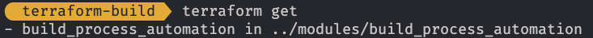
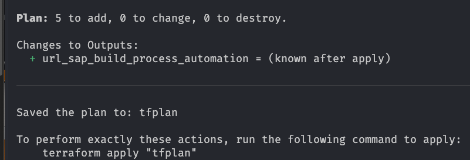
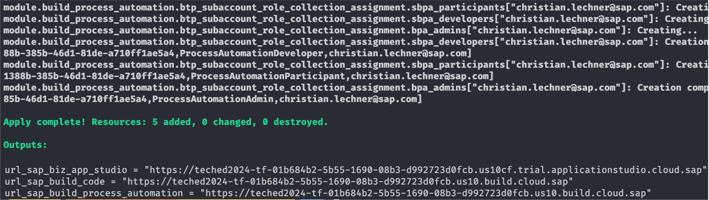
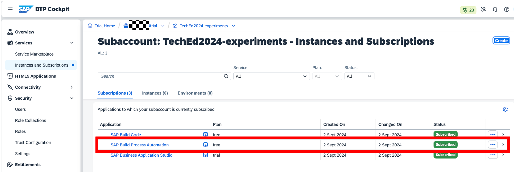
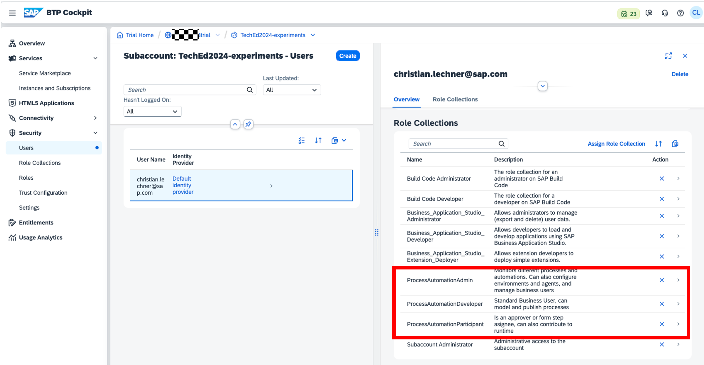
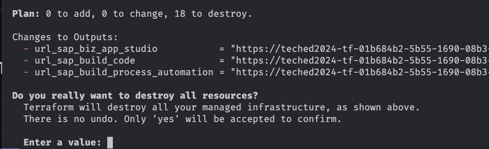
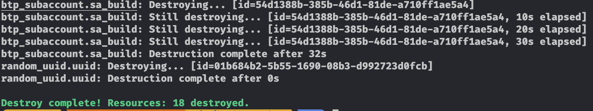

# Exercise 4 - Setup of SAP Build Process Automation

In this exercise, we will enhance the existing configuration to setup SAP Build Process Automation leveraging a Terraform module.

> [!NOTE]
> You find the solution for this exercise in the [solutions/ex4](../../solutions/ex4/) folder.

## Exercise 4.1 - Become familiar with the SAP Build Process Automation module

After completing these steps, you will know how the module for SAP Build Process Automation is structured.

As for the SAP Build Code scenario in the previous step, the setup comprises several components:

- Assignment of the entitlement for SAP Build Process Automation to the subaccount.
- Subscription to the SAP Build Process Automation application.
- Assignment of the role collections to the users to access the application.

As before we leverage a module for these tasks that is available in the folder `modules/build_process_automation`. The structure corresponds to the previous exercise. Take a few minutes to review the files in the module. Use this as a knowledge check from the previous exercise.

Once finished let us start to integrate the module into our main configuration.

## Exercise 4.2 - Configure the SAP Build Code module

After completing these steps, you will have enhanced the configuration to setup SAP Build Process Automation.

1. As the new module comes with a new variables, we must add them to our configuration. Open the `variables.tf` file, add the following code and safe your changes:

   ``` terraform
   variable "process_automation_admins" {
     type        = list(string)
     description = "Defines the users who have the role of ProcessAutomationAdmin in SAP Build Process Automation"
   }

   variable "process_automation_developers" {
     type        = list(string)
     description = "Defines the users who have the role of ProcessAutomationDeveloper in SAP Build Process Automation"
   }

   variable "process_automation_participants" {
     type        = list(string)
     description = "Defines the users who have the role of ProcessAutomationParticipant in SAP Build Process Automation"
   }
   ```

   This input will be used for the role collection assignments in the module.

1. We also need to provide the values for these variables to assign ourselves to the role collections to have access to SAP Build Process Automation. You already know the game. Open the `terraform.tfvars` file and add the following code:

   ``` terraform
   # users for SAP Build Process Automation
   process_automation_admins       = ["your.email@foo.xyz"]
   process_automation_developers   = ["your.email@foo.xyz"]
   process_automation_participants = ["your.email@foo.xyz"]
   ```

   Replace all appearances of `your.email@foo.xyz` with the email address of your SAP BTP user and safe the changes.

1. Next we need to add the module to our configuration. Open the `main.tf` file and add the following code:


   ```terraform
   module "build_process_automation" {
     source = "../modules/build_process_automation"

     subaccount_id  = btp_subaccount.sa_build.id

     process_automation_admins       = var.process_automation_admins
     process_automation_developers   = var.process_automation_developers
     process_automation_participants = var.process_automation_participants
   }
   ```

   As in the previous exercise We provided the parameters based on our variables and the ID of the subaccount `btp_subaccount.sa_build.id`. Safe your changes.

1. As final step we propagate the output of the module via the outputs of our configuration. Open the `outputs.tf` file and add the following code:

   ```terraform
   output "url_sap_build_process_automation" {
     value = module.build_process_automation.url_build_process_automation
   }
   ```

    Safe your changes and do ... yes the formatting exercise via:

    ```bash
    terraform fmt
    ```

## Exercise 4.3 - Execute Terraform

After completing these steps, you will have executed the Terraform configuration and successfully created the SAP Build Process Automation resources in your subaccount.

1. As we added another module to our setup we must reinitialize the configuration to make Terraform aware of this. To achieve this execute the following command:

    ```bash
    terraform get
    ```

    which results in the following output:

    

    As in the previous step, this adds the newly added module to the setup needed by Terraform.

> [!NOTE]
> In contrast to the initial setup via `terraform init` we want to restrict the re-initialization to the newly added modules. We achieve this by using [`terraform get`](https://developer.hashicorp.com/terraform/cli/commands/get). If you want to re-initialize the setup including provider versions you should execute [`terraform init -upgrade`](https://developer.hashicorp.com/terraform/cli/commands/init#upgrade). Be aware that this could result in newer provider versions depending on the version constraints of your provider configuration.

2. As in the previous exercises, let us validate the new configuration

    ```bash
    terraform validate
    ```
    This should show no errors. We can continue with the Terraform flow.

3. We want to check what Terraform will do when we apply the new configuration via:

    ```bash
    terraform plan -out=tfplan
    ```

    As we already have a resource created on SAP BTP this step is important to validate if the configuration is acting as expected. We also saved the plan to a file for using it later.

    Looking at the output, this looks like what we expected. Some resources will be addedd, but no changes to existing ones and no deletions:

    


4. As the planning looked good, let's apply the plan via (this might take a bit):

    ```bash
    terraform apply tfplan
    ```

    As a result we see that Terraform created the resources for SAP Build Process automation. The new output variable also shows up in the `Outputs` section at the end of the log from the Terraform CLI:

   

    A quick cross-check in the SAP BTP cockpit shows us the new resources as part of our subaccount:

    

    

## Summary

That's it folks! You've now completed the setup of an environment on SAP BTP comprising:

- The creation of an SAP BTP subaccount
- The setup of SAP Build Code
- The setup of SAP Build Process Automation

We hope you enjoyed the ride and learned something new along the way. If you have any questions or feedback, please don't hesitate to reach out to us.

With that ... happy Terraforming! 🚀

### Cleanup

Terraform also makes it easy for you to clean up the setup. If you want to remove this setup from your trial execute the following command:

```bash
terraform destroy
```
This will trigger another round of planning. Check the result if the resources that are planned for destroy match your expectations:



If they do confirm the destroy operation and enjoy the show. After the command has successfully finished, the output shows that all resources have been destroyed:



All resources you created via Terraform are now deleted from your trial account on SAP BTP.
